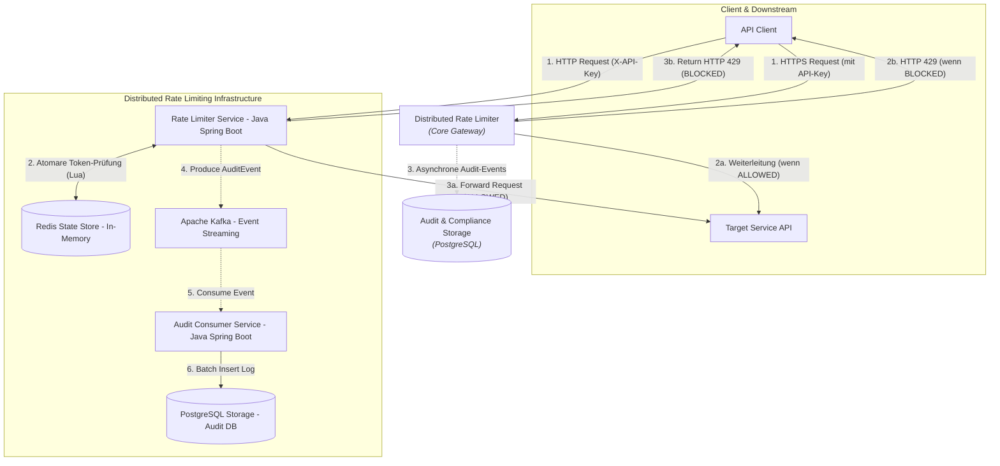

### Übersicht und Entwurfsprinzipien

Das System folgt einer zweistufigen Architektur

1. Synchrone Fast Path Entscheidungen, durch In Memory Token Bucket Prüfung in Redis die geringste Latenz erhalten (unter 5ms)
2. Asynchroner Event Driven Audit Path, vollständige Entkopplung der Audit Persistierung über Apache Kafka und PostgreSQL (Transactional Output Pattern)

### C4 - Level 1: System Context

### Kernkomponenten & Algorithmen

#### Token Bucket via Redis Lua-Script

Um Race Conditions bei parallelen Anfragen auszuschließen, läuft die Berechnung atomar in Redis:

- Key Schema: `rateLimit{api_key}`(Hash mit Feldern `tokens`und `last_updated`)
- Logik: Dynamischer Refill basierend auf der Zeitdifferenz vor dem Token Abzug

#### Asynchrones Audit Logging

- Der synchrone Request Pfad wartet nicht auf relationale Datenbank Schreibvorgänge
- Events werden mit dem Partitionierungs Key `api_key`an Kafka übergeben, um die chronologische Reihenfolge pro Client zu sichern

#### Resilienz Strategie (Fail-Open)

- Bei Nicht-Erreichbarkeit von Redis greift ein Circuit Breaker: Anfragen werden durchgelassen, um Kaskadeneffekte in der Infrastruktur zu vermeiden
- Ein System Alarm (Critical) wird geloggt
